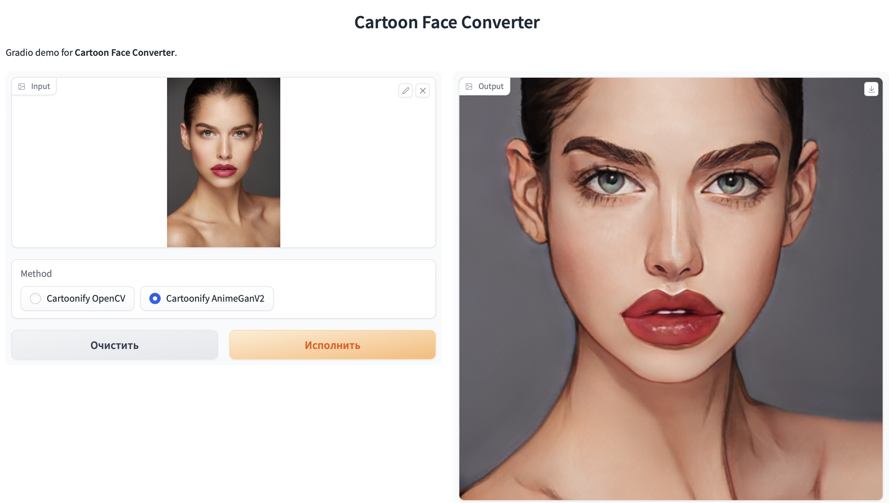
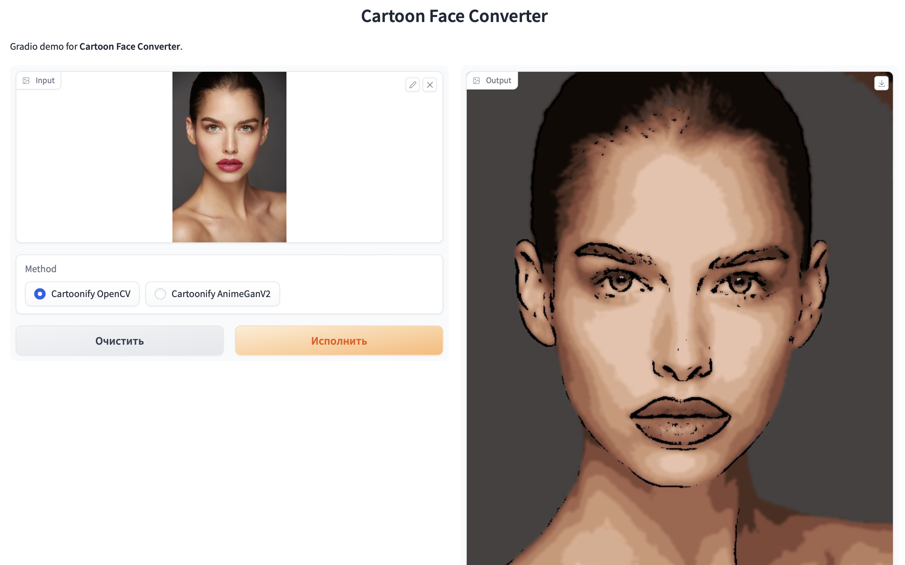

# Cartoon Face Converter 🎭

This is a Gradio demo for the Cartoon Face Converter, which can cartoonify images using OpenCV or the AnimeGANv2 model. The demo allows users to upload an image and select a method for cartoonification, and outputs the resulting cartoonified image. 😍


## Convert with AnimeGANv2 🎞️

`AnimeGANv2` - A PyTorch Implementation of AnimeGAN



## Convert with OpenCV 🎬

`OpenCV` - A library of programming functions mainly aimed at real-time computer vision

 


## Installation 💻

1. Clone the repository: 
```bash
git clone https://github.com/temirovazat/cartoon-converter.git
```

2. Navigate to the project directory:
```bash
cd cartoon-converter
```

2. Install the required Python packages: 
```bash
pip install -r requirements.txt
```

3. Run the Gradio interface: 
```bash
python src/app.py
```


## Requirements 🔍

To run the demo, you need to install the following packages:

- `gradio`
- `torch`
- `numpy`
- `opencv-python`
- `gdown`
- `scipy`
- `tqdm`
- `cmake`
- `onnxruntime-gpu`

## Acknowledgments 🙏

The Cartoon Face Converter demo uses the following tools and libraries:

- [Gradio](https://gradio.app)
- [OpenCV](https://opencv.org)
- [AnimeGANv2](https://github.com/TachibanaYoshino/AnimeGANv2)

## License 📜

This project is licensed under the [MIT License](https://github.com/temirovazat/cartoon-converter/blob/main/LICENSE).